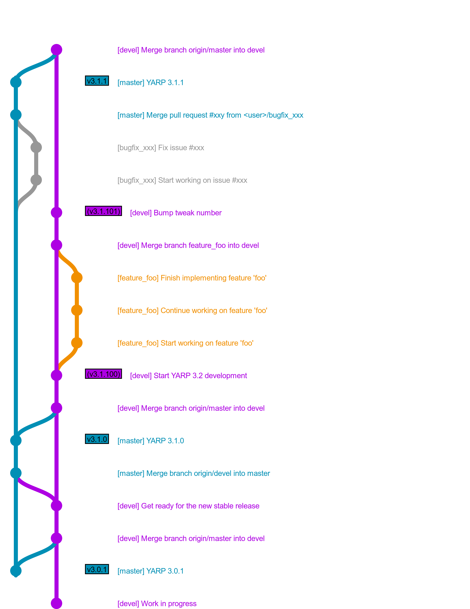

Contributing to YARP                                             {#contributing}
====================


<!-- START doctoc generated TOC please keep comment here to allow auto update -->
<!-- DON'T EDIT THIS SECTION, INSTEAD RE-RUN doctoc TO UPDATE -->
**Table of Contents**

- [Code Style](#code-style)
  - [C++](#c)
    - [Header guards](#header-guards)
  - [CMake](#cmake)
  - [Git](#git)
- [Workflow](#workflow)
  - [Stable branches: `yarp-3.x`](#stable-branches-yarp-3x)
      - [Work in progress PR](#work-in-progress-pr)
  - [Development branch: `master`](#development-branch-master)
  - [Example](#example)
  - [Terminology](#terminology)
- [Policies](#policies)
  - [Deprecated Features](#deprecated-features)
  - [`impl` Classes](#impl-classes)
  - [Supported Systems](#supported-systems)

<!-- END doctoc generated TOC please keep comment here to allow auto update -->


Code Style
----------

This is the recommended code style for YARP.

### C++

* 4 spaces indentation
* No tabs
* No white spaces at the end of the line
* One EOL at the end of the file
* All files should use UNIX end of lines

#### Header guards

* Do not use `#pragma once`, use instead `#ifndef ... #define ... #endif` macro.
* The defined macro should have this format:
  * Main libraries: `YARP_<LIB>_<FILENAME_H>` i.e. `YARP_OS_FOO_H`
  * Impl headers: `YARP_<LIB>_IMPL_<FILENAME_H>` i.e. `YARP_OS_IMPL_FOO_H`
  * Plugins (carriers and devices): `YARP_<NAME>_<CARRIER/DEVICE>_FILENAME_H` i.e.
    `YARP_HUMAN_CARRIER_HUMANSTREAM_H` and`YARP_FAKEBOT_DEVICE_FAKEBOT_H`
  * Executables (tools and GUIs): `YARP_<NAME>_FILENAME_H` i.e. `YARP_YARP_YARPROBOT_H`
    and `YARP_YARPMANAGER_QT_YSCOPEWINDOW_H`
* Add a comment in the final `#endif` containing the closed `#ifndef`.

Example:

```
#ifndef YARP_OS_FOO_H
#define YARP_OS_FOO_H

[...]

#endif // YARP_OS_FOO_H
```


### CMake

* 2 spaces indentation
* No tabs.
* Lowercase commands, i.e. `if` instead of `IF`
* No spaces between the command and the bracket, i.e. `if()` instead of `if ()`
* Do not repeat the argument in the commands closing blocks, i.e. `if(FOO) ... else() ... endif()` instead of `if(FOO) ... else(FOO) ... endif(FOO)`
* No white spaces at the end of the line
* One EOL at the end of the file
* All files should use UNIX end of lines


### Git
 * Do not push merges generated by `git pull`. Always `pull --rebase`.
 * Always check what you are pushing using some graphic tool (`qgit`,
   `gitg`, `gitk`)
 * Keep the commits small and do one and only one thing in each commit.
   Use `rebase -i` and `amend` to rewrite your **local** history and
   keep it clean.
 * Commit log should be something like this (note the empty line between
   the summary and the long description):
   ```
    Summary of the commit

    Long description of the commit wrapped at 72 characters.
    ```
 * Never force-push on the `master` and `devel` branches unless there is
   a very good reason to do it


Workflow
--------

### Stable branches: `yarp-3.x`

The `yarp-3.x` branch is stable and **should not receive new features**.
Only **bug fixes** are accepted.

This is the typical workflow to fix a bug in the yarp-3.x branches.

* Identify a bug that does not require breaking changes of the API/ABI.
* Open an issue on github.
* Add some labels.
* Assign the issue to yourself.
* Create a new branch starting from the `yarp-3.x` branch:

```
git fetch origin
git checkout -b <branch_name> origin/yarp-3.x
```

* Fix the bug and make one or more commits.
* [Push the branch on your fork and create a pull request](https://help.github.com/categories/collaborating-on-projects-using-pull-requests/).
* Wait for someone else to review your fix and merge your pull request.
* Your fix is now in the `yarp-3.x` branch, now you need to port it to the newer
  `yarp-3.x+1` branches (if any), and to the `master` branch.
  * Ensure that your branches are in sync with `origin`:

```
git checkout yarp-3.x
git pull --rebase origin yarp-3.x
git checkout master
git pull --rebase origin master
```

  * Merge yarp-3.x into master and eventually fix the conflicts.

```
git merge yarp-3.x
```

##### Work in progress PR
As final note, in case you need to start a PR but you deem it still **work-in-progress**
and don't want anyone to merge it by mistake, do the following:
- Put `[WIP]` at the beginning of the PR title.
- Mark the PR with the label `"Status: In Progress"`.

Once you're happy about your work, just remove the `[WIP]` tag as well as the label,
and drop a message within the PR to notify the community that reviews are welcome
and merging is now possible.

### Development branch: `master`


We use the branch `master` to collect the ongoing work, which is given in terms
of **new features** and **bug fixes**.

When we start the development of a new feature release, the tweak number is
bumped to 100. This number can be checked from CMake in downstream projects to
ensure that the user has all the required features.
When we introduce a new feature that will cause downstream projects to be aware
of such update, we do increase the tweak number.


### Example

This is an example of workflow involving:
* A security fix (turquoise branch) fixed in the `yarp-3.3` branch (gray) and
  later merged on the `yarp-3.4` (blue) and `master` branches (green).
* A bug fix (purple branch) (fixed in the `yarp-3.4` branch (gray) and later
  merged on the `master` branch.
* A new feature (orange branch) merged in the `devel` branch (purple).
* A few tags:
  * **v3.3.0** is the first tag (introducing new features) for the YARP 3.3 release series.
  * **v3.3.1** is a stable tag (bug fixes only) for the YARP 3.3 release series.
  * **v3.3.2** is the latest stable (bug fixes only) tag for the YARP 3.3 release series.
  * **v3.4.0** is the first tag (introducing new features) for the YARP 3.4 release series.
  * **v3.4.1** is the latest stable tag for the YARP 3.1 release series.
* A few fake development tags in the `master` branch:
  * **v3.3.100** that represents the beginning of the development of the next
    YARP 3.4 release.
  * **v3.4.100** that represents the beginning of the development of the next
    YARP 3.5 release.
  * **v3.4.101** that includes one new feature.
  These are not tagged for real in the repository, but represents the actual
  version number that other projects can check in order to require a specific
  feature and print an error that is easy to understand when that feature is not
  available (i.e. in CMake `find_package(YARP 3.4.101 REQUIRED)`)




### Terminology

- **Downstream projects**: code repositories that depend on the project under
  subject.
- **Versioning format**: the versioning system we adopt complies with the format
  <**major**>.<**minor**>.<**patch**>.
  Starting with YARP 3.0.0, the _patch_ version number is a number lower than
  100 for stable releases, and a number greater or equal than 100 for unstable
  releases.


Policies
--------

### Deprecated Features

Deprecated methods, features, classes, and tools are marked as deprecated
instead of removed. This will generate a warning when using these from other
projects, or an error if YARP is built with `YARP_NO_DEPRECATED`

No bugfixes or new features will be added to these, unless it is absolutely
necessary for some reason.

Deprecated features are definitely removed in the following major release, with
the exception of the features removed during the development between the last
minor release and the new major release, that are kept until the following
major release, in order to simplify as much as possible the migration.
During this period, it is also allowed to do breaking changes that cannot be
deprecated using the `YARP_DEPRECATED` methods.

### `impl` Classes

Classes in the "impl" namespace are not considered public. Their API is subject
to changes, without deprecation, even in a minor release.


### Supported Systems

* **Linux**: See [YARP Supported Distributions](http://wiki.icub.org/wiki/YARP_Supported_Distributions)
* **Windows**:
  * Visual Studio 15 2017 32/64 bit
  * Visual Studio 16 2019 32/64 bit
* **macOS**:
  * 10.13 High Sierra
  * 10.14 Mojave
  * 10.15 Catalina
