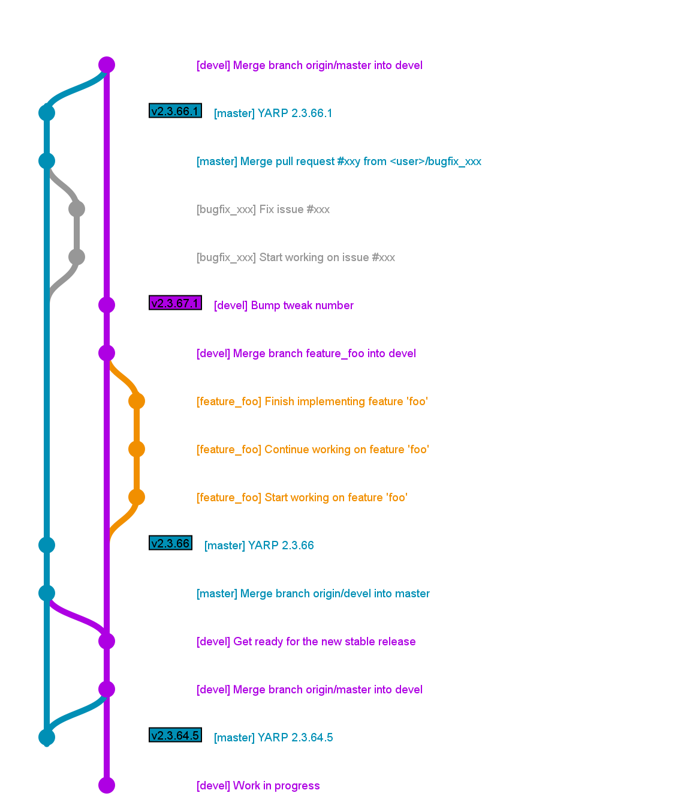

Contributing to YARP
====================


<!-- START doctoc generated TOC please keep comment here to allow auto update -->
<!-- DON'T EDIT THIS SECTION, INSTEAD RE-RUN doctoc TO UPDATE -->
**Table of Contents**

- [Code Style](#code-style)
  - [C++](#c)
    - [Header guards](#header-guards)
  - [CMake](#cmake)
  - [Git](#git)
- [Workflow](#workflow)
  - [Stable branch: `master`](#stable-branch-master)
  - [Development branch: `devel`](#development-branch-devel)
  - [Example](#example)
  - [Terminology](#terminology)
- [Policies](#policies)
  - [Deprecated features](#deprecated-features)
  - [Supported Systems](#supported-systems)

<!-- END doctoc generated TOC please keep comment here to allow auto update -->


Code Style
----------

This is the recommended code style for YARP.

### C++

* 4 spaces indentation
* No tabs
* No white spaces at the end of the line
* One EOL at the end of the file
* All files should use UNIX end of lines

#### Header guards

* Do not use `#pragma once`, use instead `#ifndef ... #define ... #endif` macro.
* The defined macro should have this format:
  * Main libraries: `YARP_<LIB>_<FILENAME_H>` i.e. `YARP_OS_FOO_H`
  * Impl headers: `YARP_<LIB>_IMPL_<FILENAME_H>` i.e. `YARP_OS_IMPL_FOO_H`
  * Plugins (carriers and modules): `YARP_<NAME>_<CARRIER/DEVICE>_FILENAME_H` i.e.
    `YARP_HUMAN_CARRIER_HUMANSTREAM_H` and`YARP_FAKEBOT_DEVICE_FAKEBOT_H`
  * Executables (tools and GUIs): `YARP_<NAME>_FILENAME_H` i.e. `YARP_YARP_YARPROBOT_H`
    and `YARP_YARPMANAGER_QT_YSCOPEWINDOW_H`
* Add a comment in the final `#endif` containing the closed `#ifndef`.

Example:

```
#ifndef YARP_OS_FOO_H
#define YARP_OS_FOO_H

[...]

#endif // YARP_OS_FOO_H
```


### CMake

* 2 spaces indentation
* No tabs.
* Lowercase commands, i.e. `if` instead of `IF`
* No spaces between the command and the bracket, i.e. `if()` instead of `if ()`
* Do not repeat the argument in the commands closing blocks, i.e. `if(FOO) ... else() ... endif()` instead of `if(FOO) ... else(FOO) ... endif(FOO)`
* Do not use the new CMake comment style, as that is supported only starting from CMake 3.0
* No white spaces at the end of the line
* One EOL at the end of the file
* All files should use UNIX end of lines


### Git
 * Do not push merges generated by `git pull`. Always `pull --rebase`.
 * Always check what you are pushing using some graphic tool (`qgit`,
   `gitg`, `gitk`)
 * Keep the commits small and do one and only one thing in each commit.
   Use `rebase -i` and `amend` to rewrite your **local** history and
   keep it clean.
 * Commit log should be something like this (note the empty line between
   the summary and the long description):
   ```
    Summary of the commit

    Long description of the commit wrapped at 72 characters.
    ```
 * Never force-push on the `master` and `devel` branches unless there is
   a very good reason to do it


Workflow
--------

### Stable branch: `master`

The `master` branch is stable and **should not receive new features**.
Only **bug fixes** are accepted.

This is the typical workflow to fix a bug in the master branch.

* Identify a bug that does not require breaking changes of the API/ABI.
* Open an issue on github.
* Add some label (FIXME which label?).
* Assign the issue to yourself.
* Create a new branch starting from the `master` branch:

```
git fetch origin
git checkout -b <branch_name> origin/master
```

* Fix the bug and make one or more commits.
* [Push the branch on your fork and create a pull request](https://help.github.com/categories/collaborating-on-projects-using-pull-requests/).
* Wait for someone else to review your fix and merge your pull request.
* Your fix is now in the `master` branch, now you need to port it to the `devel`
  branch.
  * Ensure that your branches are in sync with `origin`:

```
git checkout master
git pull --rebase origin/master
git checkout devel
git pull --rebase origin/devel
```

  * Merge master into devel and eventually fix the conflicts.

```
git merge master
```
##### Work in progress PR
As final note, in case you need to start a PR but you deem it still **work-in-progress**
and don't want anyone to merge it by mistake, do the following:
- Put `[WIP]` at the beginning of the PR title.
- Mark the PR with the label `"Status: In Progress"`.

Once you're happy about your work, just remove the `[WIP]` tag as well as the label,
and drop a message within the PR to notify the community that reviews are welcome
and merging is now possible.

### Development branch: `devel`


We use the branch `devel` to collect the ongoing work, which is given in terms
of **new features** and **bug fixes**.

When we introduce a new feature that will cause downstream projects to be aware
of such update, we do increase the tweak number (always sticking to
_odd numbers_).

When we decide to publish these new features in a new software release (roughly
each _3 months_), we merge the new modifications into `master`, doing:

```sh
git checkout master
git merge --no-ff devel
git push origin master
```


### Example

This is an example of workflow involving:
* A bug fixed in the `bugfix_xxx` branch (gray) and later merged on the `master`
  branch (blue).
* A few stable tags in the `master` branch:
  * **v2.3.64.5** is latest stable tag for the YARP 2.3.64 release series.
  * **v2.3.66** is the first stable tag for the YARP 2.3.66 release series.
  * **v2.3.66.1** is a stable tag (bug fixes only) for the YARP 2.3.66 release
    series. **v2.3.66** and **v2.3.66.1** are compatible (both API and ABI).
* The development of a new feature developed in the `feature_foo` branch (orange)
  and later merged in the `devel` branch (purple).
* Two fake development tag in the `devel` branch:
  * **v2.3.67** that represents the beginning of the development of the next
    stable release.
  * **v2.3.67.1** that includes one new feature.
  These are not tagged for real in the repository, but represents the actual
  version number that other projects can check in order to require a specific
  feature and print an error that is easy to understand when that feature is not
  available (i.e. in CMake `find_package(YARP 2.3.67.1 REQUIRED)`)




### Terminology

- **Downstream projects**: code repositories that depend on the project under
  subject.
- **Versioning format**: the versioning system we adopt complies with the format
  <**major**>.<**minor**>.<**patch**>.<**tweak**>.
  Starting with YARP 2.3.66, the _patch_ version number is an _even_ number for
  stable releases (tagged in `master`), and an _odd_ number for unstable releases
  (tagged in `devel`).


Policies
--------

### Deprecated features

Deprecated methods, features, classes, and tools are marked as deprecated
instead of removed. This will generate a warning when using these from other
projects, or an error if YARP is built with `YARP_NO_DEPRECATED`

No bugfixes or new features will be added to these, unless it is absolutely
necessary for some reason.

Deprecated features are definitely removed every 4 release series.


### Supported Systems

* **Linux**: See [YARP Supported Distributions](http://wiki.icub.org/wiki/YARP_Supported_Distributions)
* **Windows**:
  * Visual Studio 10 2010 32 bit
  * Visual Studio 11 2012 32/64 bit
  * Visual Studio 12 2013 32/64 bit
  * Visual Studio 14 2015 32/64 bit (work in progress)
* **OSX** (FIXME)
