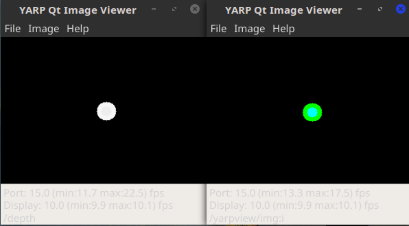

# Example of RGBD device usage


A user can interact with a YARP device driver directly inside the local application or via client/server paradigm through the network. Here are examples for both cases.

## Smoke test

A quick test can be performed by running the YARP devices with few simple commands. First we need to compile YARP repository, setting the following CMake flags to `true` in order to compile all required modules:

```
cmake .. -DYARP_COMPILE_GUIS=true -DENABLE_yarppm_depthimage_to_rgb=true -DENABLE_yarpmod_fakeDepthCamera=true
```

To fully run the test, we need to open 5 terminals for command line input.

First we need to run the yarpserver and the device driver producing the image data.
In this example we will use a fake device, for testing purposes: the `fakeDepthCamera` produces simple RGB and depth images, and it is meant to be used as an easy-to-use test data producer.

```
Terminal 1: yarpserver
Terminal 2: yarpdev --device RGBDSensorWrapper --name /server --subdevice fakeDepthCamera --mode ball
```
The parameters here means:
- device: The server we want to open
- name: name of the YARP port opened by the server will start with this prefix
- subdevice: the low-level device driver reading the images (the fake device in this case)
- mode: this parameter is propagate to the fake device; in this case the image shows a ball


Now we open 2 GUIs receiving the images produced by the fakeDevice:
```
Terminal 3: yarpview --name /view/rgb
Terminal 4: yarpview --name /view/depth
```

Finally we connect the producer to the viewer
```
Terminal 5: yarp connect /server/rgbImage:o   /view/rgb   udp
Terminal 5: yarp connect /server/depthImage:o /view/depth udp+recv.portmonitor+type.dll+file.depthimage_to_rgb
```

Expected result:




## Local Application

This way of using a device driver is shown in file [`RGBD_test_1a.cpp`](RGBD_test_1a.cpp).
In this example the dummy device called `fakeDepthCamera` is used, which is a software plugin emulating the features of a standard RGBD device. The `depthCamera` device shall be used instead, when operating with a real HW device.
In order to use it, we have to tell YARP framework we want to open a device called `fakeDepthCamera`.

``` c++
Property config;
config.put("device", "fakeDepthCamera");            // device producing (fake) data

PolyDriver dd;
dd.open(config);
```

The Polydriver class will load the required plugin and the makes it available to the user.
In order to access specific functionality offered by the driver, the user must access to the right YARP interface.
Polydriver offers the 'view' functionality which expose a particular interface (or view) of the device driver.

``` c++
yarp::dev::IRGBDSensor *RGBDInterface;              // interface we want to use
dd.view(RGBDInterface);
```
Now, the user can easily access the device functionality by mean of the interface pointer:

``` c++
// Let's use the interface to get info from device
int rgbImageHeight   = RGBDInterface->getRgbHeight();
int rgbImageWidth    = RGBDInterface->getRgbWidth();
FlexImage rgbImage;
ImageOf<PixelFloat> depthImage;
bool gotImage = RGBDInterface->getImages(rgbImage, depthImage);   // Acquire both images
```

## Remote Application


The general procedure for instantiating devices does not change when using server/client paradigm, the only difference is the name of the device to be opened.

#### Server side:
The server side application will still open the device driver, but now it will also open the corresponding YARP server used to broadcast data over the network and reply to Remote Procedure Calls (RPC).
This way of using a device driver is shown in file [`RGBD_test_1b_server.cpp`](RGBD_test_1b_server.cpp), the server class is called `RGBDSensorWrapper`:

``` c++
PolyDriver wrapperDriver;
Property   wrapperConfig;

// Wrapper config
wrapperConfig.put("device", "RGBDSensorWrapper");       // Network server broadcasting data through network
wrapperConfig.put("name",   "/server");                 // Prefix for port names opened by the YARP server

// Instantiating RGBD server
wrapperDriver.open(wrapperConfig);
```

The `fakeDepthCamera` device driver is opened in the very same way as before. After we open the device, we can couple server and device driver by calling the `attach` function:

```
yarp::dev::IWrapper *wrapperInterface;
wrapperDriver.view(wrapperInterface);
wrapperInterface->attach(&rgbdDriver);                  // Bind the wrapper with the actual device
```

#### Client side:

The client needs to know hot to reach the server, therefore we need to provide port names as additional information.
List of parameters is explained here:  [RGBDSensorClient](http://www.yarp.it/classyarp_1_1dev_1_1RGBDSensorClient.html).

This way of using a device driver is shown in file `RGBD_test_1b_client.cpp`.

``` C++
PolyDriver clientDriver;
Property   clientConfig;

// client configuration
clientConfig.put("device", "RGBDSensorClient"); // Network client receiving data from YARP network
clientConfig.put(<paramName>, <paramValue>);

// Instantiating RGBD client
clientDriver.open(clientConfig);
```


As in the local application, the user has to get the `view` of the required interface to operate on:

``` C++
yarp::dev::IRGBDSensor *RGBDInterface;              // interface we want to use
clientDriver.view(RGBDInterface);                   // wanted device interface

// Let's use the interface to get info from device
int rgbImageHeight   = RGBDInterface->getRgbHeight();
int rgbImageWidth    = RGBDInterface->getRgbWidth();

FlexImage rgbImage;
ImageOf<PixelFloat> depthImage;
bool gotImage = RGBDInterface->getImages(rgbImage, depthImage);   // Acquire both images

<...>
clientDriver.close();
```
