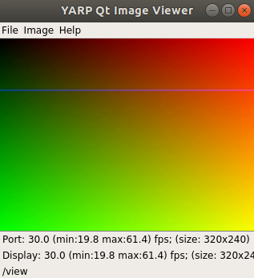

# libffmpeg_portmonitor
## Description

This port monitor allows you to compress a video stream while transmitting it from a source YARP port to a destination YARP port. <br>
The port monitor relies on the open source library Ffmpeg to encode and decode video streams.
<br>
You can choose the desired codec usign the command line, along with numerous other possible parameters (see [Parameters](#Parameters)).
If the "codec" parameter is not set, it will be set to a default value.

## Installation

To install/activate the port monitor you need to enter the <yarp_root>/build folder (if the "build" folder does not exist, create it) and run the following command:
```
cmake .. -DENABLE_yarpcar_libffmpeg=on
```
Once the command is run, make sure there is an "x" in the brackets on the libffmpeg_portmonitor line in the CMake configuration (command ccmake ..), as you can see below:
```
--  [x]   Plugin: yarpcar_libffmpeg (ENABLE_yarpcar_libffmpeg)
```
Then, run the following commands to make the changes effective:
```
make
sudo make install
```
To speed up the execution of the "make" command, you can specify the number of recipes to execute at once after the "-j" parameter, such as
```
make -j4
```
to execute 4 recipes at a time.

## Usage

The software allows the entry of a wide range of parameters via the command line.<br>
The string:
```
yarp connect /grabber /view <protocol>+send.portmonitor.+file.libffmpeg+recv.portmonitor+file.libffmpeg+type.dll
```
is the basic command to connect source and receiver through the port monitor; we will refer to this string in the following as “Connection base string”. <br>

The \<protocol\> section in the connection base string represents the protocol used for the transmission between sender and receiver; for example, it can be:
-   tcp
-   fast_tcp
-   udp

<br>
In order to insert other parameters into the connection string, you have to follow the syntax below:<br>

```
connection_base_string+parameter_name.parameter_value
```
So you concatenate a "+" to the connection base string, followed by the name of the parameter to be set and a "." followed by the value to assign to the parameter.
All the parameters will be passed to the compression/decompression context of the Ffmpeg library.

## Parameters

The parameters that can be set on the command line can have different types.<br>
The encoding formats implemented are:
-   H264
-   H265
-   MPEG2VIDEO

If no codec is chosen via the connection string, MPEG2VIDEO codec is used as default. <br>
Parameters can be used to manipulate image quality. For example, the right values for "qmin" and "qmax" parameters can lead you to the best quality (at the expense of the bandwidth).
The best values for these two parameters for each codec are defined in [this page](https://slhck.info/video/2017/02/24/vbr-settings.html) and reported in the following table. <br>
| Codec       | qmin        | qmax        |
| ----------- | ----------- | ----------- |
| h264        | 18          | 28          |
| h265        | 24          | 34          |
| mpeg2video  | 3           | 5           |

In order to control image quality, you can also use the "crf" parameter. The lower the crf value, the better the image quality and vice versa. <br>
Furthermore, changing the value of the "crf" parameter (as well as of "qmin" and "qmax") indirectly affects the occupied bandwidth, making the encoding a VBR one (Variable Bit Rate).
The best values for the parameter "crf" can be still found in the page above.

| Codec       | crf         |
| ----------- | ----------- |
| h264        | 23          |
| h265        | 28          |
| mpeg2video  | 3           |


---------------------------------------------------------------------QUIII
## Example

A very simple example is to use, for the port monitor, as input the test_grabber device and as output the view. <br>
Using different terminals the next procedure can be followed: <br>
### Terminal 1
```
yarp server
```

### Terminal 2
```
yarpdev --device test_grabber --mode grid
```

### Terminal 3
```
yarpview --name /view
```

### Terminal 4
```
yarp connect /grabber /view fast_tcp+send.portmonitor+file.libffmpeg+recv.portmonitor+file.libffmpeg+type.dll
```
<br>
The result is a line moving from top to bottom in a colored space, as seen in the following image.
<br><br>


<br>
The terminals can be on different machines, as long as the IP address and port is set in the yarp configuration of each machine where the command
```
yarp server
```
is executed.<br>
To check the configuration you can use the command:
```
yarp conf
```
which returns the file location to change the IP address and port.
<br><br>
Installing the necessary plugins and following the same procedure, you can for example play videos saved on the machine by running the following command (instead of the terminal 2 command)
```
yarpdev --device ffmpeg_grabber --source path/to/file
```
or even see live the video stream of a video camera, such as that of the gazebo simulator.
