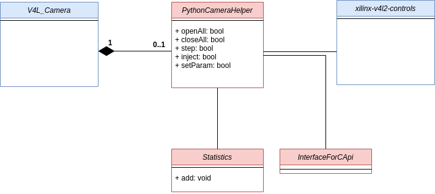
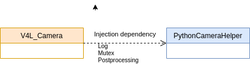
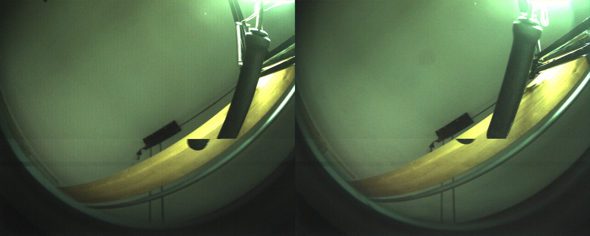
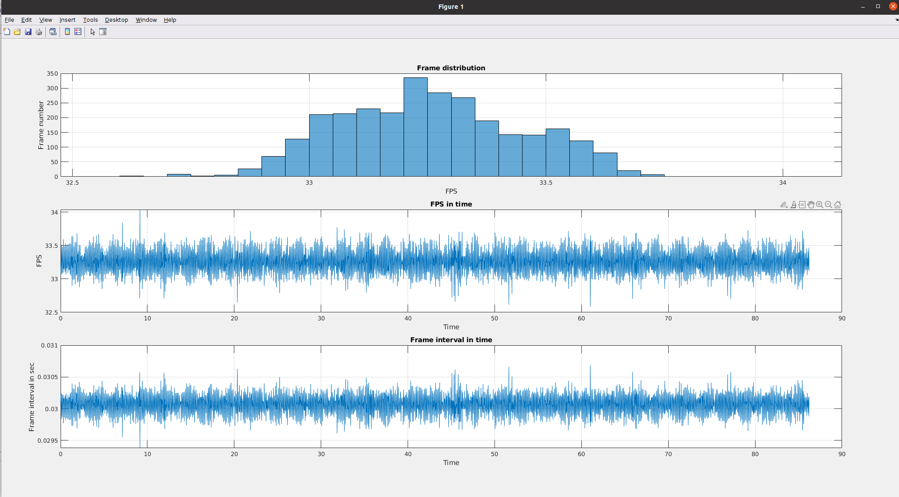
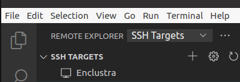
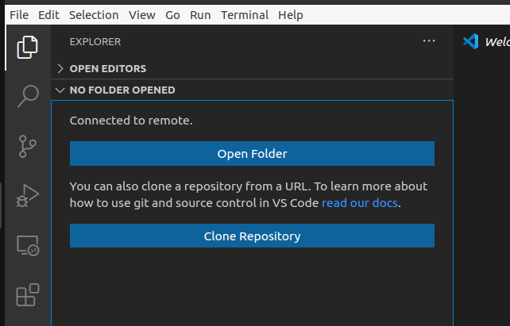

# 1. USING ULTRAPYTHON CAMERA

In this README I will use the following devices:

- **iCubHead** also known ad PC104. IP address 10.0.0.1
- **Xilinx board**, the board for the UltraPython cameras. IP address 10.0.0.233

## 1.1. yarpdev for UltraPython camera

This section describes how to execute yarpdev for UltraPython camera.  
:exclamation:\*On iCubHead

```
yarpserver --write
```

:exclamation:\*On Xilinx **only the very first time**:

```
yarp conf
```

modify the file given from the previous command as follow:  
add to the empty file:`10.0.0.1 10000`.  
Then:

```
cd <where UltraPython .ini file is stored>
yarpdev --from ultra.ini
```

:exclamation:\*On iCubHead

```
./frameGrabberGui2 --local /xxx --remote /grabber/rpc
yarpview
yarp connect /grabber /yarpview/img:i
```

## 1.2. ini file for UltraPython camera

Create a file ultra.ini like this:

```
device grabberDual
subdevice usbCamera
period 30
capabilities COLOR
twoCameras false
name /grabber
camModel ultrapython
subsampling
framerate 1
honorfps false
d /dev/media0

```

Two ini files can be found in `ultrapython_ini` folder.

## 1.3. UltraPython specifications for yarpdev

### 1.3.1. Resolution

2560x1024 (full)  
1280x512 (subsampling)

### 1.3.2. Color space

For now the only choose is RGB.

### 1.3.3. Kernel modules

The following kernel modules are loaded and used by UltraPython, order is important:

```bash
insmod xilinx_frmbuf.ko
insmod v4l2-fwnode.ko
insmod videobuf2-dma-contig.ko
insmod xilinx-vip.ko
insmod xilinx-video.ko is_mplane=0
insmod xilinx-vpss-csc.ko
insmod xilinx-vtc.ko
insmod xilinx-tpg.ko
insmod xilinx-demosaic.ko
insmod xilinx-python1300-rxif.ko dyndbg==p
insmod imgfusion.ko
insmod python1300.ko
```

### 1.3.4. Device

Once the modules are loaded the following devices can be used.  

Main device:  
`/root/media0` 

Subdevices:  
`/root/dev/v4l-subdev0`  
`/root/dev/v4l-subdev1`  
`/root/dev/v4l-subdev2`  
`/root/dev/v4l-subdev3`  
`/root/dev/v4l-subdev4`  
`/root/dev/v4l-subdev5`  
`/root/dev/v4l-subdev6`  
`/root/dev/v4l-subdev7`  
`/root/dev/v4l-subdev8`

## 1.4. yarpdev parameters for UltraPython

1. `device`, Yarp Device to be used --> grabberDual
2. `subdevice`, Yarp Subdevice to be used --> usbCamera
3. `camModel`, is the camModel to be used --> ultrapython.
4. `name`, local Yarp port number --> /grabber
5. `framerate`, FPS to be used --> no more used for UltraPython put to 1
6. `d`, device name --> /dev/media0
7. `subsampling`, enable the subsampling mode. If not specified
8. `period` YARP read period in msec. It is equivalent to 1/FPS. Note that for UltraPython, it replaces the `framerate` param.
9. `capabilities` --> COLOR
10. `twoCameras` --> false

## 1.5. yarpdev new parameters for UltraPython

1. `camModel python`, is the camModel to be used.
2. `subsampling`, enable the subsampling mode. If not specified the subsampling mode is **working mode**.
3. `honorfps` --> true if fps must be constant. off. This is the

## 1.6. yarpdev removed parameters for UltraPython

`--width` and `--height` have been removed. The resolution is fixed as the **working mode** is specified.

## 1.7. V4L parameters that can be used together UltraPython

Currently exposed parameters:
|Name|Code|Default|Min|Max|Note|Status|
|-|-|-|-|-|-|-|
|Gain|0x00980913|1|1|11|mapped to a combination of digital and analog gain of the board|Working|
|Exposure/shutter|0x0098cb03|20msec|1msec|100000msec|limited between 15 msec and 100msec mapped on **tag_l**|Working|
|White balance|0x0098c9a3-0x0098c9a4|50|0|100|mapped to to the read and blue gain|Working|
|Brightness|0x0098c9a1|50|0|100|mapped to to the read and blue gain|Working|
|Subsampling|0x0098cc01|0|0|1|1==subsampling, via specific API|Working|

Internal parameters setted by default:
|Name|Code|Default|Min|Max|Note|Status|
|-|-|-|-|-|-|-|
|ext_trigger|0x0098cc03|1|0|1|Need to be set to 1|Working|
|tag_h|0x0098cb02|8msec|1msec|100000msec|Dead time between exposures|Working|

Only manual parameters are available for now no auto settings.  
_Note_ that can be accepted parameters normalized between 0-1 or absolute value. FrameGrabberGu2 send normalized (0-1) parameters.

## 1.8. FPS (frames per second)

It is possible to specify the desired FPS, however FPS has a relation with the exposure.

`Max_Exposure=(1/FPS-8) msec`

The following table is calculated.

| FPS | period msec | Max Exposition in msec |
| --- | ----------- | ---------------------- |
| 5   | 200         | 0.192                  |
| 10  | 100         | 0.100                  |
| 15  | 66          | 0.066                  |
| 20  | 50          | 0.050                  |
| 25  | 40          | 0.040                  |
| 30  | 33          | 0.033                  |
| 35  | 28          | 0.028                  |
| 40  | 25          | 0.025                  |
| 45  | 22          | 0.022                  |

- if `honorfps` is true the max exposition in mandatory
- the yarpdev parameter `period` is used by YARP to sample images from the drive at the given period in msec

# 2. usbcamera driver SW modifications

The software follows the c++17 standard.  
To minimize modifications in the old code and to keep separate old and new cameras code, we create a new class `PythonCameraHelper`. All the UltraPython camera functionalities are developed inside of it.
If necessary, the class is instantiated by the driver.  
New PythonCameraHelper class in UML class diagram:



An **dependency injection technique** is used to keep driver and UltraPython camera code separate, so
test and use of the class in other environment, _are easier_.  


## 2.1. PytonCameraHelper Cmake options

The following CMake option should be used to compile UltraPython device:

```
ENABLE_yarpmod_usbCamera        ON
ENABLE yarpmod_usbCameraRaw     ON
```

The only new options for UltraPython are:

```
YARP_USE_UDev                    ON
COMPILE_WITHUNITTEST_ULTRAPYTH   OFF
```

UDev is in the advanced section. Unittest is OFF by default.

## 2.2. Code formatting and naming convention

The code formatting is done using the included `.clang-format` file.  
The c++ style follows mainly the https://google.github.io/styleguide/cppguide.html with some notable exceptions.

## 2.3. Unittest

I have developed unit tests with the `gtest` and `gmock` library see https://google.github.io/googletest/.
The tests can be found in `unittest` folder.

# 3. Testing the video stream

To test the stream I have developed the following procedure:

- execute on **iCubHead** yarpserver
- execute on **Xilinx** yarpdev
- execute on **iCubHead** the following commands

  ```
  yarpdatadumper --name /log --rxTime --txTime --type image
  yarp connect /grabber /log fast_tcp

  ```

- Analyze the data in `./log` using the Matlab scripts or manually, see above.

## 3.1. Slow movment artifact

These kind of artifacts are due to bad memory management. They should be checked by hand, looking at the singles frames.  


## 3.2. Frames per second (FPS)

Fps behaviour should be analyzed with the matlabscript in `matlabscript` folder, script name FPS_check.m.
Once the script is executed choose the yarpdaadumper log.  
Result example:  


## 3.3. Development environment

To develop the software on the Xilinx board is necessary to setup a remote development environment, as Xilinx board can't be used with a UI.  
We have decided to use vscode with ssh extension.

:exclamation:<u>To be done on iCub-head and with running Xilinx board.</u>

Download and install vscode:https://code.visualstudio.com/  
Install plugin for vscode named:

- `ms-vscode-remote.remote-ssh`
- `ms-vscode-remote.remote-ssh-edit`
- `xaver.clang-format`

Edit file ~/.ssh/config, add at the end:

```
Host Xilinx
  HostName 10.0.0.233
  User root
  ForwardAgent yes
```

Connect using the correct host among your list (`Connect to Host in surrent windows`):



then you can open the remote folder on the same windows:



Choose the remote folder `/root/icubtech/yarp/src/devices/usbCamera/linux`

A remote terminal is also available from the `Terminal` menu.

:exclamation:_Troubleshooting_

1. If vscode won't connect try to check Xilinx board file system.
   `fsck / -y` Then restart boot Xilinx board and vscode.
2. If vscode still won't connect try to delete, on Xilinx board, the following files:

```
rm /root/.vscode-server/.*
```
